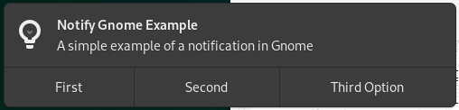
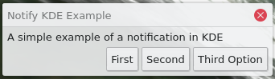

# notify

_Scriptable desktop notifications for Linux_

`notify` is a simple executable meant to do one thing and do it well - give 
users a way to notify end users when something important occurs on their 
system. This isn't a replacement for notifications that an application 
handles natively, but instead aims to be a better alternative to `notify-send`

## Goals

* [X] Working across multiple distros
* [X] Working on multiple window managers (Gnome and KDE at least)
* [X] Working on headless systems
* [X] Offering means for user interaction with the notification (such as
  buttons, signals, etc.)
* [X] Ability to specify a timeout (in minutes) that the notification expires
  after
* [X] Fully scriptable
* [ ] Attempt to not be locked in to a single platform

## What it looks like

Notifications are presented normally based on what your window manager provides.
Here are a couple of instances for what they look like when launched with the
following commands:

`./notify -t 2 -o First -v 1 -o Second -v 2 -o "Third Option" -v 3 "Notify <WM>
Example" "A simple example of a notification in <WM>"`

### Gnome



### KDE



## Usage

```
notify [options] <TITLE> <DESCRIPTION>

Options:
    --option|-o     An option, up to 3 are allowed. Options are displayed in
                    the notification buttons.
    --value|-v      A value, up to 3 are allowed. Values are printed when a
                    notification option is selected.
    --timeout|-t    Notification lifetime, in minutes.
    --icon|-i       The desired icon name to be displayed in the notification.
```

## Building

### Native

When you are building natively on your distro of choice, you will need to ensure
that you have the development requirements from above installed on your system.
Once that is all said and done, you should be able to build `notify` by simply
running `make` from your terminal.

It is worth noting that `make` on its own will run through everything in the
build process, including linting and testing, as well as outputting the
executable at the end. You may select individual build targets as well.

### Containerized

If you could like to develop and compile `notify` in a docker container, you are
more than welcome to do so. We have set up multiple build environments (or will,
given time) so you can build for your distribution of choice. See 
`containers/build/` for the currently-available list of container files.

**NOTE**: All container commands are meant to be run from the top-level 
directory of `notify`.

Building within a container file is done like so:  
`./bin/oci-make`

This will take charge of determining your container runtime environment,
checking if you already have a build container image (or building it, if
needed), and running `make` within the container. For more information, see the
[Development Documentation](./docs/development/README.md).

## Development Requirements

Below is a list of packages required for their various distributions to build
and test notify. If your distribution isn't listed, feel free to add it!

If you are interested in reading further information on development 
practices and how to contribute, see the 
[Development Documentation](./docs/development/README.md).

### Fedora

dnf/yum

```
bash
clang
findutils
gmock-devel
gtest-devel
gtk3-devel
jq
lcov
libnotify-devel
llvm
make
python3-pip
```

pip3

```
compiledb
```

For quick setup, run `bin/configure` (requires sudo access, currently only for
Fedora systems).

### Ubuntu

apt-get

```
bash
build-essential
clang
clang-tools
findutils
gtk+-3-dev
jq
lcov
libgmock-dev
libgtest-dev
libnotify-dev
llvm
pkg-config
python3-pip
```

pip3

```
compiledb
```

### Other distros

**FIXME**: No instructions yet.

# License

Apache 2
